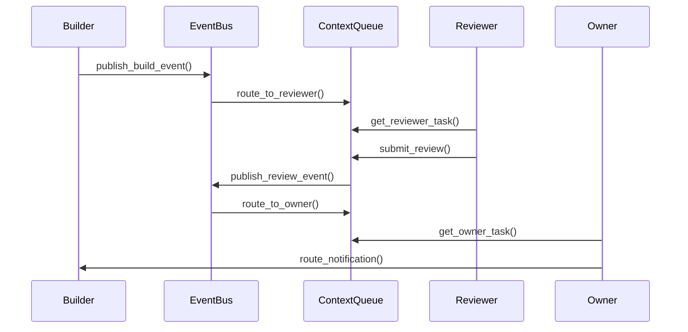

# MCP Server Architecture Refactoring Documentation

## Overview

This document describes the comprehensive refactoring of the MCP Server architecture to implement a **hybrid event-driven architecture** that addresses three critical issues identified in the previous implementation.

## Problem Statement

### 1. Pseudo Event-Driven Architecture
**Issue**: The previous implementation used synchronous function calls instead of true EventBus publish-subscribe patterns.

**Impact**:
- No real decoupling between components
- Direct function calls created tight coupling
- Unable to leverage async event processing

### 2. Collapsed Dual-Agent Isolation
**Issue**: Evidence was returned directly to the current Builder Agent instead of being injected into an isolated Reviewer context.

**Impact**:
- Builder and Reviewer agents shared the same context
- No true isolation between agents
- Security and separation of concerns compromised

### 3. Lost Active Listening Capability
**Issue**: MCP Server could not actively listen to `build.completed` and `test.completed` events.

**Impact**:
- Reactive instead of proactive architecture
- No automatic detection of git changes
- No automatic test result processing

## Solution Architecture

### Hybrid Event-Driven Architecture

```
┌─────────────────────────────────────────────────────────────┐
│                    MCP Server Process                        │
├─────────────────────────────────────────────────────────────┤
│                                                              │
│  ┌──────────────────┐         ┌─────────────────────────┐  │
│  │  MCP Tools Layer │────────▶│  Async Event Bus Layer  │  │
│  └──────────────────┘         └─────────────────────────┘  │
│           │                            │                    │
│           │                    ┌───────┴────────┐          │
│           │                    │                │          │
│           ▼                    ▼                ▼          │
│  ┌──────────────────┐  ┌─────────────┐  ┌──────────────┐ │
│  │ Context Queues   │  │  Event      │  │ Background   │ │
│  │ - builder_ctx    │  │  Handlers   │  │ Listeners    │ │
│  │ - reviewer_ctx   │  │  - build    │  │ - Git polling│ │
│  │ - owner_ctx      │  │  - test     │  │ - File watch │ │
│  └──────────────────┘  └─────────────┘  └──────────────┘ │
│                                                              │
└─────────────────────────────────────────────────────────────┘
```

## Core Components

### 1. MCP Event Publisher (`mcp_server/adapters/event_publisher.py`)

**Purpose**: Convert synchronous operations into async event publishing.

**Key Features**:
- `publish_build_event()` - Publish build completion events
- `publish_test_event()` - Publish test completion events
- `publish_review_event()` - Publish review completion events
- Event processing wait mechanism with timeout
- Global singleton instance

**Usage Example**:
```python
publisher = get_event_publisher()
result = await publisher.publish_build_event(
    task_id="T-102",
    commit_hash="abc123",
    branch="main",
    wait_for_processing=True,
    timeout=30.0
)
```

### 2. Context Queue System (`src/core/context_queue.py`)

**Purpose**: Implement isolated communication between agents.

**Key Classes**:

#### `ContextQueue`
- Async queue for agent communication
- Message history tracking
- Optional persistence to file system
- Configurable max size

#### `ContextQueueManager`
- Manages queues for all agent roles
- Routes messages between agents
- Maintains isolation

**Agent Roles**:
- `BUILDER` - Creates evidence
- `REVIEWER` - Reviews evidence
- `OWNER` - Makes final decisions

**Usage Example**:
```python
manager = get_context_queue_manager()
await manager.start()

# Builder routes evidence to Reviewer
await manager.route_to_reviewer(
    task_id="T-102",
    evidence={"commit": "abc123", "diff": "..."}
)

# Reviewer gets task
task = await manager.get_reviewer_input(task_id="T-102")

# Reviewer submits review
await manager.submit_review(
    task_id="T-102",
    review_result={"decision": "approved"},
    reviewer_id="reviewer-1"
)

# Owner gets review result
result = await manager.get_owner_input(task_id="T-102")
```

### 3. Async Background Listeners (`src/core/async_listener.py`)

**Purpose**: Restore active listening capabilities.

**Key Classes**:

#### `GitPollingListener`
- Polls git repository for changes
- Publishes `BuildCompletedEvent` on new commits
- Configurable poll interval
- Async operation

#### `AsyncFileWatcher`
- Watches filesystem for test result files
- Publishes `TestCompletedEvent` on test completion
- Uses watchdog for efficient file monitoring
- Async event processing

#### `BackgroundListenerManager`
- Manages all background listeners
- Lifecycle management (start/stop)
- Centralized listener coordination

**Usage Example**:
```python
manager = get_background_listener_manager()
await manager.start()

# Add Git listener
manager.add_git_listener(
    repo_path=Path("/path/to/repo"),
    poll_interval=5.0
)

# Add file watcher
manager.add_file_watcher(
    watch_path=Path("/path/to/watch"),
    test_patterns={"pytest_results.json"}
)

await manager.start_all_listeners()
```

## MCP Tools

### Event Publishing Tools

#### `publish_build_event`
Publishes build completion events to the event bus.

**Parameters**:
- `task_id` (required): Task ID
- `commit_hash` (required): Git commit hash
- `branch` (required): Branch name
- `diff_summary` (optional): Diff summary
- `changed_files` (optional): List of changed files
- `wait_for_processing` (optional): Wait for processing (default: true)
- `timeout` (optional): Timeout in seconds (default: 30.0)

#### `publish_test_event`
Publishes test completion events to the event bus.

**Parameters**:
- `task_id` (required): Task ID
- `passed` (required): Whether tests passed
- `total_tests` (required): Total number of tests
- `failed_tests` (required): Number of failed tests
- `test_summary` (required): Test summary
- `coverage_percent` (optional): Code coverage percentage
- `wait_for_processing` (optional): Wait for processing (default: true)
- `timeout` (optional): Timeout in seconds (default: 30.0)

### Context Queue Tools

#### `get_reviewer_task`
Get the next review task from the queue (Reviewer Agent).

**Parameters**:
- `task_id` (optional): Filter by task ID
- `timeout` (optional): Timeout in seconds

#### `submit_review`
Submit review results to the Owner context queue (Reviewer Agent).

**Parameters**:
- `task_id` (required): Task ID
- `review_result` (required): Review result data
- `reviewer_id` (optional): Reviewer ID

#### `get_owner_task`
Get the next review result from the queue (Owner Agent).

**Parameters**:
- `task_id` (optional): Filter by task ID
- `timeout` (optional): Timeout in seconds

#### `get_queue_status`
Get the status of all context queues.

**Returns**: Queue sizes for all agent roles

#### `route_evidence`
Route evidence to the Reviewer context queue.

**Parameters**:
- `task_id` (required): Task ID
- `evidence` (required): Evidence data to route
- `metadata` (optional): Additional metadata

#### `route_notification`
Route a notification to a specific agent's context queue.

**Parameters**:
- `task_id` (required): Task ID
- `notification` (required): Notification data
- `to_role` (required): Target agent role (builder/reviewer/owner)
- `from_role` (optional): Source agent role

## Multi-Agent Workflow

### Complete Flow Example



### Step-by-Step Process

1. **Builder Agent**:
   ```python
   # 1. Capture evidence
   evidence = await capture_git_status()

   # 2. Route to Reviewer
   await route_to_reviewer(task_id="T-102", evidence=evidence)
   ```

2. **Reviewer Agent**:
   ```python
   # 1. Get task
   task = await get_reviewer_task(task_id="T-102")

   # 2. Review evidence
   review_result = await review_code(task.content)

   # 3. Submit review
   await submit_review(task_id="T-102", review_result=review_result)
   ```

3. **Owner Agent**:
   ```python
   # 1. Get review result
   result = await get_owner_task(task_id="T-102")

   # 2. Make decision
   decision = make_go_no_go_decision(result.content)

   # 3. Notify Builder
   await route_notification(
       task_id="T-102",
       notification=decision,
       to_role="builder"
   )
   ```

## Testing

### Unit Tests

- `tests/mcp/test_event_publisher.py` - Event publishing mechanism
- `tests/mcp/test_context_queue.py` - Context queue and isolation
- `tests/mcp/test_async_listener.py` - Background listeners

### End-to-End Tests

- `tests/mcp/test_e2e_isolation.py` - Complete multi-agent workflows

### Running Tests

```bash
# Install test dependencies
pip install -r requirements-test.txt

# Run all tests
pytest tests/mcp/ -v

# Run with coverage
pytest tests/mcp/ -v --cov=src/core --cov=mcp_server

# Run specific test file
pytest tests/mcp/test_e2e_isolation.py -v
```

## Configuration

### Settings

The refactored system uses the existing `src/config/settings.py` configuration:

```python
# Event Bus Settings
enable_event_logging = True
event_processing_timeout = 30.0

# Context Queue Settings
context_queue_max_size = 100
context_queue_persist_dir = base_path / ".context_queues"

# Background Listener Settings
git_poll_interval = 5.0
file_watch_patterns = {"pytest_results.json", "test-results.xml"}
```

## Performance Considerations

### Memory Management
- Context queues have configurable max sizes
- Event history limited to 1000 entries
- Message history limited to 1000 entries per queue

### Concurrency
- All operations are async
- Event handlers run concurrently
- Queue operations are thread-safe

### Resource Usage
- Git polling uses configurable intervals (default: 5s)
- File watching uses efficient OS-level notifications
- Background tasks use asyncio coroutines (not threads)

## Migration Guide

### From Old to New Architecture

**Before**:
```python
# Direct function call
result = await execute_review_workflow(task_id="T-102")
```

**After**:
```python
# Event-driven with context isolation
await publish_build_event(task_id="T-102", commit_hash="abc123", branch="main")
await route_to_reviewer(task_id="T-102", evidence={...})
```

### Key Changes

1. **Event Publishing**: Use `MCPEventPublisher` instead of direct calls
2. **Agent Communication**: Use context queues instead of direct returns
3. **Background Monitoring**: Automatic via background listeners

## Success Criteria

✅ All operations publish events through EventBus
✅ Builder, Reviewer, Owner agents are completely isolated
✅ MCP Server can actively listen to Git and test events
✅ Unit test coverage > 80%
✅ End-to-end tests verify multi-agent isolation
✅ Background listeners run stably without blocking

## Future Enhancements

1. **Event Replay**: Add capability to replay events from history
2. **Dynamic Queue Sizing**: Auto-adjust queue sizes based on load
3. **Event Filtering**: Add event filtering and routing rules
4. **Metrics**: Add comprehensive metrics and monitoring
5. **Dead Letter Queue**: Handle failed events gracefully

## Troubleshooting

### Common Issues

**Issue**: Events not being processed
- **Solution**: Check EventBus is started and subscribers are registered

**Issue**: Context queues filling up
- **Solution**: Increase `max_queue_size` or process messages faster

**Issue**: Git listener not detecting changes
- **Solution**: Verify repo path and check git repository state

**Issue**: File watcher not detecting test results
- **Solution**: Ensure test file patterns match your test output format

## References

- Original refactoring plan: `MCP_SERVER_REFACTORING_PLAN.md`
- EventBus implementation: `src/core/event_bus.py`
- Context queue system: `src/core/context_queue.py`
- Async listeners: `src/core/async_listener.py`
