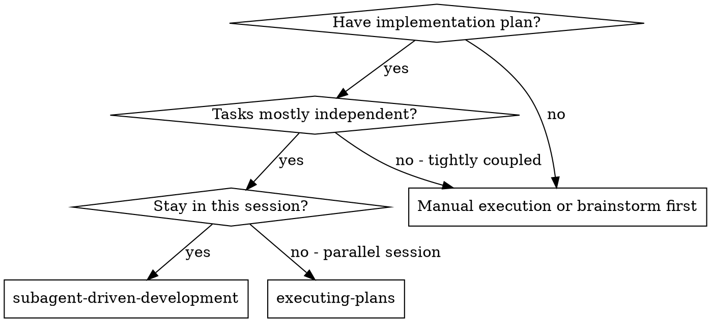
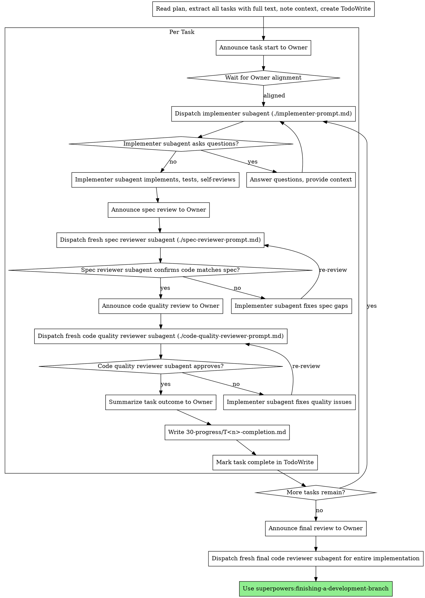

# Subagent-Driven Development

Execute the post-worktree task stream by dispatching a fresh implementer subagent per task, followed by independent review after each task: spec compliance first, then code quality.

In this project, this skill starts only after the four-stage preparation chain is complete, `using-git-worktrees` has established the implementation workspace, and the Owner has explicitly chosen `subagent-driven-development` as the formal execution path.

## Execution Boundaries (Project Override)

When the controlling plan states **"SKILL.md/documentation-only phase"**, all dispatched subagents must obey:

- Do not create or modify runtime code files (`*.py`, `*.js`, `*.ts`, `src/*`, `scripts/*`, `orchestrator/*`)
- Restrict work to `SKILL.md` and planning/contract/progress documents
- If any subagent identifies required runtime implementation, return `NEEDS_CONTEXT` and ask for explicit phase switch

**Why subagents:** You delegate tasks to specialized agents with isolated context. By precisely crafting their instructions and context, you ensure they stay focused and succeed at their task. They should never inherit your session's context or history — you construct exactly what they need. This also preserves your own context for coordination work.

**Core principle:** Fresh implementer per task + fresh reviewer per review gate + project transparency protocol = controlled execution.

## Subagent Dispatch Tool Contract

This project relies on the platform's subagent tools. The controller must treat tool-call formatting as a hard execution gate, not as an implementation detail.

### Required rule

When calling `spawn_agent` or `send_input`, provide **exactly one** of the following:

- `message`
- `items`

Never provide both in the same tool call.

### Project-safe default

Unless there is a concrete need for structured mentions or images, use **`message` only**.

That means:

- put the full subagent instructions in `message`
- omit the `items` field entirely from the request structure
- do not attach duplicate text in `items`
- do not try to split the same prompt across `message` and `items`

Likewise, when using an `items`-based dispatch, omit the `message` field entirely.

### Why this matters

If both fields are present with meaningful content, the subagent may fail to start and the task has **not** entered true SDD execution yet.

In that situation, do not pretend the implementer or reviewer was dispatched.

### Dispatch recovery rule

If `spawn_agent` returns an input-shape error such as:

- `Provide either message or items, but not both`

then the controller must:

1. report to the Owner that dispatch failed before the subagent actually started
2. correct the tool payload
3. retry with a single-channel payload
4. only after successful dispatch announce that the fresh implementer/reviewer is actually running

Do not blur together:

- prompt design failure
- subagent launch success

These are separate states and must be reported separately.

### Recommended dispatch pattern

For implementer, spec reviewer, and code quality reviewer dispatches in this project, prefer:

- `message`: populated with the fully rendered prompt
- `items`: omitted entirely
- `fork_context`: `false` unless the task explicitly requires inheriting the current thread

Only use `items`-based dispatch when structured mentions are actually necessary.

## Required task completion artifact

After each task passes implementation and both review gates, the controller must produce an Owner-facing completion document under:

- `30-progress/T<n>-completion.md`

Where `<n>` is the task sequence number from the current execution stream.

This document is not optional summary prose in chat. It is a required progress artifact that the Owner can inspect before the next task proceeds.

## When to Use



**vs. Executing Plans (Owner-selected alternate path):**
- Same session (no context switch)
- Fresh subagent per task (no context pollution)
- Two-stage review after each task: spec compliance first, then code quality
- Better fit when the Owner wants per-task fresh implementer/reviewer isolation inside the current session

Do not present this skill as the automatic default after `using-git-worktrees`.

The correct sequence is:

1. `using-git-worktrees` prepares the isolated workspace
2. Owner chooses the formal execution path
3. If the choice is `subagent-driven-development`, this skill begins

## The Process



## Model Selection

Use the least powerful model that can handle each role to conserve cost and increase speed.

**Mechanical implementation tasks** (isolated functions, clear specs, 1-2 files): use a fast, cheap model. Most implementation tasks are mechanical when the plan is well-specified.

**Integration and judgment tasks** (multi-file coordination, pattern matching, debugging): use a standard model.

**Architecture, design, and review tasks**: use the most capable available model.

**Task complexity signals:**
- Touches 1-2 files with a complete spec → cheap model
- Touches multiple files with integration concerns → standard model
- Requires design judgment or broad codebase understanding → most capable model

## Handling Implementer Status

Implementer subagents report one of four statuses. Handle each appropriately:

**DONE:** Proceed to spec compliance review.

**DONE_WITH_CONCERNS:** The implementer completed the work but flagged doubts. Read the concerns before proceeding. If the concerns are about correctness or scope, address them before review. If they're observations (e.g., "this file is getting large"), note them and proceed to review.

**NEEDS_CONTEXT:** The implementer needs information that wasn't provided. Provide the missing context and re-dispatch.

**BLOCKED:** The implementer cannot complete the task. Assess the blocker:
1. If it's a context problem, provide more context and re-dispatch with the same model
2. If the task requires more reasoning, re-dispatch with a more capable model
3. If the task is too large, break it into smaller pieces
4. If the plan itself is wrong, escalate to the human

**Never** ignore an escalation or force the same model to retry without changes. If the implementer said it's stuck, something needs to change.

## Transparency Protocol

This skill must follow the project skill:

- `skills/development-transparency-protocol/SKILL.md`

Treat that protocol as required project behavior, not optional reference material.

Minimum enforcement in this skill:

1. Before implementation starts, controller must announce task start and wait for Owner alignment.
2. Before dispatching the implementer, controller must explicitly announce that a fresh implementer subagent will be used.
3. Before each reviewer dispatch, controller must make reviewer invocation visible to the Owner.
4. Before the next task starts, controller must summarize task outcome to the Owner.
5. Before the next task starts, controller must write the corresponding `30-progress/T<n>-completion.md` artifact.
6. For high-risk or wide-scope tasks, controller must enforce preview-before-write.

## Review Isolation Protocol

The implementer is never allowed to approve its own work.

Rules:

1. Each task uses a fresh implementer subagent.
2. Spec review must be performed by a separate fresh reviewer subagent.
3. Code quality review must be performed by a separate fresh reviewer subagent.
4. Reviewer invocation must be announced to the Owner before dispatch.
5. Re-review after fixes must use a fresh reviewer subagent again; do not reuse the previous reviewer session.
6. No task is complete until both review gates pass.
7. Final implementation review, if run, must also use a fresh reviewer subagent and be announced to the Owner.

Controller checklist per task:

1. Name the task and the documents actually read.
2. Announce the fresh implementer subagent before dispatch.
3. Refuse any implementer attempt to self-approve.
4. Announce the fresh spec reviewer before dispatch.
5. Announce the fresh code quality reviewer before dispatch.
6. Write `30-progress/T<n>-completion.md` before moving on.
7. Only then mark the task complete.

Reviewer-facing announcement wording should follow `development-transparency-protocol` instead of inventing new local templates here.

## Prompt Templates

- `./implementer-prompt.md` - Dispatch implementer subagent
- `./spec-reviewer-prompt.md` - Dispatch spec compliance reviewer subagent
- `./code-quality-reviewer-prompt.md` - Dispatch code quality reviewer subagent

## Example Workflow

```
You: I'm using Subagent-Driven Development to execute this plan.

[Read plan file once: docs/superpowers/plans/feature-plan.md]
[Extract all 5 tasks with full text and context]
[Create TodoWrite with all tasks]

Task 1: Hook installation script

[Get Task 1 text and context (already extracted)]
[Dispatch implementation subagent with full task text + context]

Implementer: "Before I begin - should the hook be installed at user or system level?"

You: "User level (~/.config/superpowers/hooks/)"

Implementer: "Got it. Implementing now..."
[Later] Implementer:
  - Implemented install-hook command
  - Added tests, 5/5 passing
  - Self-review: Found I missed --force flag, added it
  - Committed

[Dispatch spec compliance reviewer]
Spec reviewer: ✅ Spec compliant - all requirements met, nothing extra

[Get git SHAs, dispatch code quality reviewer]
Code reviewer: Strengths: Good test coverage, clean. Issues: None. Approved.

[Mark Task 1 complete]

Task 2: Recovery modes

[Get Task 2 text and context (already extracted)]
[Dispatch implementation subagent with full task text + context]

Implementer: [No questions, proceeds]
Implementer:
  - Added verify/repair modes
  - 8/8 tests passing
  - Self-review: All good
  - Committed

[Dispatch spec compliance reviewer]
Spec reviewer: ❌ Issues:
  - Missing: Progress reporting (spec says "report every 100 items")
  - Extra: Added --json flag (not requested)

[Implementer fixes issues]
Implementer: Removed --json flag, added progress reporting

[Spec reviewer reviews again]
Spec reviewer: ✅ Spec compliant now

[Dispatch code quality reviewer]
Code reviewer: Strengths: Solid. Issues (Important): Magic number (100)

[Implementer fixes]
Implementer: Extracted PROGRESS_INTERVAL constant

[Code reviewer reviews again]
Code reviewer: ✅ Approved

[Mark Task 2 complete]

...

[After all tasks]
[Dispatch final code-reviewer]
Final reviewer: All requirements met, ready to merge

Done!
```

## Advantages

**vs. Manual execution:**
- Subagents follow TDD naturally
- Fresh context per task (no confusion)
- Parallel-safe (subagents don't interfere)
- Subagent can ask questions (before AND during work)

**vs. Executing Plans:**
- Same session (no handoff)
- Continuous progress (no waiting)
- Review checkpoints automatic

**Efficiency gains:**
- No file reading overhead (controller provides full text)
- Controller curates exactly what context is needed
- Subagent gets complete information upfront
- Questions surfaced before work begins (not after)

**Quality gates:**
- Self-review catches issues before handoff
- Two-stage review: spec compliance, then code quality
- Review loops ensure fixes actually work
- Spec compliance prevents over/under-building
- Code quality ensures implementation is well-built

**Cost:**
- More subagent invocations (implementer + 2 reviewers per task)
- Controller does more prep work (extracting all tasks upfront)
- Review loops add iterations
- But catches issues early (cheaper than debugging later)

## Red Flags

**Never:**
- Start implementation on main/master branch without explicit user consent
- Skip reviews (spec compliance OR code quality)
- Proceed with unfixed issues
- Dispatch multiple implementation subagents in parallel (conflicts)
- Make subagent read plan file (provide full text instead)
- Let implementer act as reviewer
- Mark a task complete without Owner-visible review announcements
- Skip scene-setting context (subagent needs to understand where task fits)
- Ignore subagent questions (answer before letting them proceed)
- Accept "close enough" on spec compliance (spec reviewer found issues = not done)
- Skip review loops (reviewer found issues = implementer fixes = review again)
- Let implementer self-review replace actual review (both are needed)
- **Start code quality review before spec compliance is ✅** (wrong order)
- Move to next task while either review has open issues

**If subagent asks questions:**
- Answer clearly and completely
- Provide additional context if needed
- Don't rush them into implementation

**If reviewer finds issues:**
- Implementer (same subagent) fixes them
- Reviewer reviews again
- Repeat until approved
- Don't skip the re-review

**If subagent fails task:**
- Dispatch fix subagent with specific instructions
- Don't try to fix manually (context pollution)

## Integration

**Required workflow skills:**
- **superpowers:using-git-worktrees** - REQUIRED: Set up isolated workspace before starting
- **superpowers:writing-plans** - Creates the plan this skill executes
- **superpowers:requesting-code-review** - Code review template for reviewer subagents
- **superpowers:finishing-a-development-branch** - Complete development after all tasks

**Subagents should use:**
- **superpowers:test-driven-development** - Subagents follow TDD for each task

**Alternative workflow:**
- **superpowers:executing-plans** - Use for parallel session instead of same-session execution
