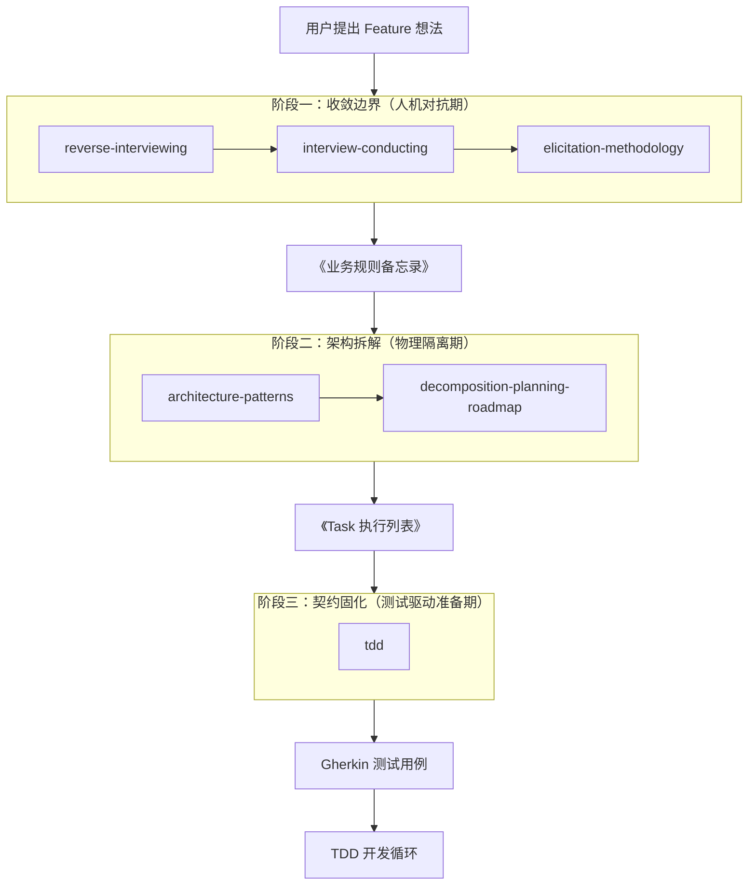

# 三阶段 SOP 技能输入输出流程详细拆解

## 完整流程图



---

# 阶段一：收敛边界（人机对抗期）

## Skill 1: reverse-interviewing

### 触发条件
- 用户提出一个粗略的 Feature 想法
- 关键词："我想做一个..."、"帮我设计一个..."、"需求分析"

### 输入
```yaml
原始输入:
  type: "自然语言需求描述"
  example: "我想做一个用户评论功能"

特征:
  - 模糊
  - 不完整
  - 缺乏细节
  - 有歧义
```

### 处理过程

#### Phase 1: 理解激活 (2-5 个问题)
```yaml
动作: AI 向用户提问
问题类型:
  - 核心概念澄清
  - 目标用户确认
  - 核心价值确认

示例问题:
  Q1: "这个功能的目标用户是谁？"
  Q2: "要解决什么核心问题？"
  Q3: "期望达到什么效果？"

输出: 初步需求理解
```

#### Phase 2: 功能深挖 (5-10 个问题)
```yaml
动作: AI 向用户追问细节
问题类型:
  - 输入数据规格
  - 输出数据规格
  - 处理逻辑
  - 用户操作

示例问题:
  Q1: "评论的展示形式是怎样的？（列表、嵌套回复...）"
  Q2: "对评论内容有什么限制？（字数、敏感词...）"
  Q3: "用户可以对评论进行哪些操作？"

输出: 详细功能规格
```

#### Phase 3: 边界探索 (3-5 个问题)
```yaml
动作: AI 探索边缘情况
问题类型:
  - 数据边界
  - 用户边界
  - 系统边界
  - 环境边界

示例问题:
  Q1: "评论的层级深度有限制吗？"
  Q2: "删除评论时，子评论如何处理？"
  Q3: "敏感词检测是在提交时实时检测吗？"

输出: 完整边界定义
```

#### Phase 4: 非功能需求 (2-4 个问题)
```yaml
动作: AI 确认非功能要求
问题类型:
  - 性能要求
  - 安全要求
  - 可用性要求
  - 可扩展性要求

示例问题:
  Q1: "响应时间有什么要求？"
  Q2: "需要什么级别的安全保障？"
  Q3: "需要支持多少并发用户？"

输出: 非功能需求列表
```

#### Phase 5: 确认总结
```yaml
动作: AI 生成备忘录并确认
处理步骤:
  1. 总结关键需求点
  2. 生成《业务规则备忘录》
  3. 请用户确认

输出: 待确认的《业务规则备忘录》
```

### 输出
```yaml
输出类型: 《业务规则备忘录》(Business Rules Memo)
格式: Markdown / YAML
内容结构:
  meta:
    created_at: "2025-04-09 22:00:00"
    version: "1.0"
    status: "draft"

  requirement_overview:
    name: "文章评论系统"
    description: "为文章添加评论功能，支持用户互动"
    background: "增加用户参与度，提升内容价值"
    objectives:
      - "允许登录用户对文章进行评论"
      - "支持嵌套回复"
      - "提供内容审核机制"

  functional_requirements:
    - id: "FR-001"
      title: "评论发布"
      description: "登录用户可以发布评论"
      priority: "must"
      acceptance_criteria:
        - "用户输入评论内容后点击提交"
        - "系统验证内容格式和敏感词"
        - "评论保存到数据库"
        - "页面刷新显示新评论"

  non_functional_requirements:
    performance:
      - "评论列表响应时间 < 500ms"
      - "支持 1000 并发用户"
    security:
      - "需要登录才能评论"
      - "敏感词过滤"
      - "防刷机制（同一用户 30 秒内只能发布 1 条）"

  business_rules:
    - id: "BR-001"
      title: "评论层级限制"
      description: "评论最多支持 3 层嵌套"
      conditions:
        - "当前层级 < 3"
      actions:
        - "显示回复按钮"
      exceptions:
        - "当前层级 >= 3": "不显示回复按钮"

  data_requirements:
    - entity: "Comment"
      fields:
        - name: "id"
          type: "UUID"
          required: true
          unique: true
        - name: "content"
          type: "Text"
          required: true
          validation: "1-500 字符，敏感词过滤"
        - name: "author_id"
          type: "UUID"
          required: true
        - name: "article_id"
          type: "UUID"
          required: true
        - name: "parent_id"
          type: "UUID"
          required: false

  edge_cases:
    - scenario: "评论内容为空"
      handling: "返回错误提示，不允许提交"
    - scenario: "评论内容超过 500 字符"
      handling: "截断并提示用户"
    - scenario: "包含敏感词"
      handling: "拒绝提交，提示用户修改"

  exceptions:
    - scenario: "网络中断"
      detection: "API 请求超时"
      handling: "本地缓存，重试机制"
      user_prompt: "网络连接失败，请检查网络后重试"

  assumptions:
    - "用户已登录系统"
    - "文章已存在"
    - "数据库支持事务"

  dependencies:
    - "用户认证系统"
    - "敏感词过滤服务"
    - "数据库服务"
```

### 传递给下一个技能
```yaml
传递方式:
  - 作为 interview-conducting 的上下文
  - 作为 elicitation-methodology 的输入

传递内容:
  - 需求概述
  - 功能需求列表
  - 已识别的模糊地带（如果有）
```

---

## Skill 2: interview-conducting

### 触发条件
- reverse-interviewing 检测到需要更结构化的访谈
- 或者有真实的利益相关者可以访谈

### 输入
```yaml
来自 reverse-interviewing:
  需求概述: "文章评论系统"
  初步功能需求: ["评论发布", "嵌套回复", "内容审核"]
  已识别的模糊点: ["审核机制细节", "性能要求具体值"]

可选输入:
  真实利益相关者信息:
    name: "产品经理"
    role: "需求提供者"
    availability: "可进行深度访谈"
```

### 处理过程

#### 访谈模式选择
```yaml
真实利益相关者模式:
  条件: 有真实人员可访谈
  工具: AskUserQuestion
  流程:
    1. AI 作为访谈者
    2. 向真实利益相关者提问
    3. 收集回答
    4. 深挖细节

模拟模式:
  条件: 无真实人员可访谈
  工具: Task (启动 stakeholder-simulation)
  流程:
    1. AI 启动多角色模拟
    2. 生成不同角色的观点
    3. 识别冲突点
    4. 标记需确认项
```

#### LLMREI 访谈结构
```yaml
Phase 1: Opening (2-3 分钟)
  目标: 建立关系，设定期望
  示例对话:
    AI: "感谢您参与访谈。我想了解一下文章评论系统的详细需求。"
    AI: "访谈大约需要 15-20 分钟，我会问一些关于功能、性能、安全的问题。"
    AI: "让我们从基本场景开始..."

Phase 2: Context Gathering (5-10 分钟)
  目标: 理解视角，识别关注点
  示例问题:
    - "从产品角度，评论功能的核心价值是什么？"
    - "您最担心的问题是什么？"
    - "还有谁应该参与这个讨论？"

Phase 3: Requirements Exploration (15-25 分钟)
  目标: 提取功能需求、非功能需求、约束
  示例问题:
    - "发布评论的完整流程是什么？"
    - "当您说'快速响应'时，具体是指多少毫秒？"
    - "如果检测到敏感词，用户会看到什么？"

Phase 4: Validation (5-10 分钟)
  目标: 总结验证，识别缺口
  示例动作:
    - "让我总结一下：评论系统需要..."
    - "我们有遗漏什么吗？"
    - "这些需求的优先级如何？"

Phase 5: Closing (2-3 分钟)
  目标: 感谢，说明下一步
  示例对话:
    - "感谢您的时间。我会整理成《业务规则备忘录》。"
    - "接下来我们会进行架构设计，可能还需要您的输入。"
```

### 输出
```yaml
输出类型: 访谈记录 + 更新的《业务规则备忘录》
格式: YAML / Markdown

interview_summary:
  session_id: "INT-2025-04-09-001"
  stakeholder_role: "产品经理"
  duration_minutes: 20
  date: "2025-04-09 22:30:00"
  autonomy_level: "semi-auto"

  key_themes:
    - "用户体验优先"
    - "内容安全可控"
    - "性能可扩展"

  requirements_elicited:
    - id: "FR-004"
      text: "敏感词检测必须实时"
      confidence: "high"
      type: "functional"
      priority: "must"
      source: "stakeholder_interview"

  follow_up_needed:
    - "审核员的具体权限边界需要进一步明确"
    - "性能压测的指标需要技术团队确认"

  conflicts_detected:
    - personas: ["end-user", "business"]
      issue: "用户体验 vs 内容安全平衡"
      eu_position: "减少审核等待时间"
      business_position: "严格内容审核"
      resolution: "异步审核 + 敏感词前置过滤"

  updated_business_rules_memo:
    # 基于访谈更新后的备忘录
```

### 传递给下一个技能
```yaml
传递给: elicitation-methodology

传递内容:
  - 访谈记录
  - 更新的《业务规则备忘录》
  - 识别的冲突点
  - 待确认事项

触发条件:
  - 需要多源需求整合
  - 需要缺口分析
  - 需要导出规范格式
```

---

## Skill 3: elicitation-methodology

### 触发条件
- interview-conducting 完成后
- 需要多源需求整合
- 需要进行缺口分析

### 输入
```yaml
来自 interview-conducting:
  访谈记录:
    session_id: "INT-2025-04-09-001"
    requirements_elicited: [...]
    conflicts_detected: [...]

  更新的《业务规则备忘录》:
    functional_requirements: [...]
    business_rules: [...]

其他输入源（可选）:
  documents: ["PRD_v1.0.pdf", "竞品分析.docx"]
  domain_research: "评论系统行业最佳实践"
  stakeholder_simulation: "多角色模拟结果"
```

### 处理过程

#### 标准发现工作流
```yaml
1. CONTEXT GATHERING（上下文收集）
   输入: 所有现有需求文档
   处理:
     - 加载业务上下文
     - 识别可用来源
     - 选择自主级别

   输出: 需求来源清单

2. MULTI-SOURCE ELICITATION（多源需求获取）
   处理:
     - Interviews（访谈）→ 已由 interview-conducting 完成
     - Document extraction（文档提取）→ 如有 PRD 文档
     - Domain research（领域研究）→ 如需行业知识
     - Stakeholder simulation（利益相关者模拟）→ 如需多方观点

   输出: 多源需求数据

3. SYNTHESIS（综合）
   处理:
     - 合并所有来源的需求
     - 去重
     - 分类（功能、非功能、约束）
     - MoSCoW 优先级排序

   输出: 综合需求清单

4. VALIDATION（验证）
   处理:
     - Gap analysis（缺口分析）
     - Completeness checking（完整性检查）
     - Conflict detection（冲突检测）
     - INVEST 评分

   输出: 验证报告

5. OUTPUT（输出）
   处理:
     - 保存到 .requirements/{domain}/
     - 生成摘要报告
     - 准备导出规范格式

   输出: 最终《业务规则备忘录》
```

#### 缺口分析
```yaml
gaps_identified:
  - category: "functional"
    description: "评论举报功能未定义"
    severity: "major"
    recommendation: "需要补充举报流程和处理机制"

  - category: "non-functional"
    description: "性能指标不够具体"
    severity: "minor"
    recommendation: "技术团队需要提供具体 SLA"
```

#### 完整性检查
```yaml
completeness_check:
  dimensions:
    - name: "功能覆盖"
      status: "complete"
      score: 90
      missing: ["举报功能", "评论排序策略"]

    - name: "用户角色"
      status: "complete"
      score: 100
      roles: ["普通用户", "作者", "审核员", "管理员"]

    - name: "异常处理"
      status: "partial"
      score: 70
      missing: ["数据库连接失败", "第三方服务超时"]

    - name: "非功能需求"
      status: "complete"
      score: 95
      covered: ["性能", "安全", "可用性"]
```

### 输出
```yaml
输出类型: 规范化《业务规则备忘录》
格式: YAML（可转换为多种格式）

最终输出:
  id: "REQ-SET-001"
  title: "文章评论系统需求"
  domain: "content-management"
  elicitation_date: "2025-04-09"
  autonomy_level: "semi-auto"

  sources:
    - type: "interview"
      reference: "INT-2025-04-09-001"
      timestamp: "2025-04-09 22:30:00"
    - type: "document"
      reference: "PRD_v1.0.pdf"
      timestamp: "2025-04-09 22:00:00"

  requirements:
    - id: "REQ-001"
      text: "登录用户可以发布文章评论"
      source: "interview"
      source_ref: "INT-2025-04-09-001"
      priority: "must"
      category: "functional"
      confidence: "high"
      validation_status: "validated"

  gaps_identified:
    - category: "functional"
      description: "评论举报功能未定义"
      severity: "major"

  metadata:
    total_sources: 2
    total_requirements: 15
    gap_count: 2
    ready_for_specification: true

  # 可导出格式
  export_options:
    - format: "canonical"
      description: "标准规范格式"
    - format: "ears"
      description: "EARS 模式格式"
    - format: "gherkin"
      description: "Gherkin/BDD 格式"
```

### 传递给阶段二
```yaml
传递给: architecture-patterns
传递方式: 作为架构设计的输入

传递内容:
  - 功能需求列表
  - 非功能需求（性能、安全...）
  - 业务规则
  - 数据规范
  - 约束条件

文件: .requirements/content-management/requirements.yaml
```

---

# 阶段二：架构拆解（物理隔离期）

## Skill 4: architecture-patterns

### 触发条件
- 《业务规则备忘录》已完成
- 需要进行架构设计
- 用户触发："架构设计"、"洋葱模型"

### 输入
```yaml
来自阶段一:
  requirements.yaml:
    functional_requirements:
      - id: "FR-001"
        title: "评论发布"
        description: "登录用户可以发布评论"
      - id: "FR-002"
        title: "嵌套回复"
        description: "支持 3 层嵌套回复"
      - id: "FR-003"
        title: "敏感词过滤"
        description: "实时检测敏感词"

    non_functional_requirements:
      performance:
        - "评论列表响应时间 < 500ms"
        - "支持 1000 并发用户"
      security:
        - "需要登录才能评论"
        - "敏感词过滤"

    business_rules:
      - id: "BR-001"
        title: "评论层级限制"
        description: "最多 3 层嵌套"

    data_requirements:
      - entity: "Comment"
        fields: [...]
```

### 处理过程

#### 架构模式选择
```yaml
分析需求特征:
  - 领域复杂度: 中等
  - 业务规则: 有明确业务规则
  - 可扩展性: 需要支持高并发
  - 测试性: 需要易于测试

推荐模式: Clean Architecture + DDD
理由:
  - 业务规则复杂，需要领域模型
  - 需要独立于框架的测试
  - 需要支持未来扩展
```

#### 分层设计
```yaml
Layer 1: Domain Layer（领域层）
  目标: 核心业务逻辑
  组成:
    - Entities: Comment, User, Article
    - Value Objects: CommentContent, Email
    - Domain Events: CommentPosted, CommentModerated
    - Repository Interfaces: ICommentRepository

  依赖: 无（最内层）

Layer 2: Use Cases Layer（用例层）
  目标: 应用业务规则
  组成:
    - Use Cases: CreateCommentUseCase, ModerateCommentUseCase
    - DTOs: CreateCommentRequest, CreateCommentResponse

  依赖: Domain Layer

Layer 3: Interface Adapters Layer（接口适配器层）
  目标: 转换数据格式
  组成:
    - Controllers: CommentController
    - Repositories: PostgresCommentRepository
    - Gateways: SensitiveWordGateway

  依赖: Domain Layer, Use Cases Layer

Layer 4: Frameworks Layer（框架层）
  目标: 外部系统交互
  组成:
    - Web Framework: FastAPI
    - Database: PostgreSQL
    - External Services: 敏感词 API

  依赖: 无（被依赖）
```

#### 依赖规则
```yaml
依赖方向: 向内依赖
规则:
  - Domain Layer: 不依赖任何层
  - Use Cases Layer: 只依赖 Domain Layer
  - Interface Adapters: 只依赖 Domain 和 Use Cases
  - Frameworks: 被所有层依赖，但不依赖业务层
```

### 输出
```yaml
输出类型: 架构设计文档 + 目录结构
格式: Markdown + 目录树

architecture_design:
  pattern: "Clean Architecture + DDD"
  description: "清洁架构结合领域驱动设计"

  layers:
    - name: "domain"
      path: "app/domain/"
      components: ["entities/", "value_objects/", "repositories/"]

    - name: "use_cases"
      path: "app/use_cases/"
      components: ["create_comment.py", "moderate_comment.py"]

    - name: "adapters"
      path: "app/adapters/"
      components: ["controllers/", "repositories/", "gateways/"]

    - name: "infrastructure"
      path: "app/infrastructure/"
      components: ["database.py", "config.py", "event_bus.py"]
```

---

## Skill 5: decomposition-planning-roadmap

### 触发条件
- 架构设计已完成
- 需要创建实施计划
- 用户触发："任务分解"、"执行计划"

### 输入
```yaml
来自 architecture-patterns:
  architecture_design:
    layers: ["domain", "use_cases", "adapters", "infrastructure"]
    domain_model:
      aggregates:
        - name: "Comment"
          entities: ["Comment", "CommentReply"]
          repositories: ["ICommentRepository"]
```

### 处理过程

#### 优先级排序
```yaml
prioritization:
  - task: "创建 Comment 聚合"
    risk: "low"
    value: "high"
    dependencies: []
    priority_score: 9

  - task: "实现 PostgresCommentRepository"
    risk: "medium"
    value: "high"
    dependencies: ["ICommentRepository"]
    priority_score: 7

  - task: "实现 CreateCommentUseCase"
    risk: "medium"
    value: "high"
    dependencies: ["Comment聚合", "ICommentRepository"]
    priority_score: 6
```

#### 创建阶段路线图
```yaml
phased_roadmap:
  phase_1:
    name: "Domain Foundation"
    duration: "Week 1-2"
    tasks:
      - id: "TASK-001"
        title: "创建 Comment 聚合根"
        effort: "3 days"
      - id: "TASK-002"
        title: "实现 CommentContent 值对象"
        effort: "1 day"

  phase_2:
    name: "Use Cases Implementation"
    duration: "Week 3-4"
    tasks:
      - id: "TASK-004"
        title: "实现 CreateCommentUseCase"
        effort: "2 days"

  phase_3:
    name: "Adapters & Infrastructure"
    duration: "Week 5-6"
    tasks:
      - id: "TASK-007"
        title: "实现 PostgresCommentRepository"
        effort: "2 days"
```

### 输出
```yaml
输出类型: 《Task 执行列表》
格式: Markdown + YAML

task_execution_list:
  meta:
    total_phases: 4
    total_tasks: 14
    estimated_duration: "8 weeks"

  tasks:
    - id: "TASK-001"
      phase: 1
      title: "创建 Comment 聚合根"
      priority: "high"
      effort: "3 days"
      acceptance_criteria:
        - "Comment 实体定义完整"
        - "业务规则验证实现"
```

---

# 阶段三：契约固化（测试驱动准备期）

## Skill 6: tdd

### 触发条件
- Task 执行列表已完成
- 开始具体的 Task 实现
- 用户触发："TDD"、"测试驱动开发"

### 输入
```yaml
来自 decomposition-planning-roadmap:
  task_execution_list:
    tasks:
      - id: "TASK-001"
        title: "创建 Comment 聚合根"
        acceptance_criteria:
          - "Comment 实体定义完整"
          - "业务规则验证实现"

  business_rules:
    - id: "BR-001"
      title: "评论层级限制"
      description: "最多 3 层嵌套"
```

### 处理过程

#### Red-Green-Refactor 循环
```yaml
Red Phase（编写失败测试）:
  处理:
    1. 分析需求，确定测试场景
    2. 编写测试用例
    3. 运行测试（预期失败）

Green Phase（编写最小实现）:
  处理:
    1. 编写最小代码使测试通过
    2. 运行测试（预期通过）

Refactor Phase（重构代码）:
  处理:
    1. 改进代码质量
    2. 保持测试通过
```

#### Gherkin 场景生成
```gherkin
Feature: 文章评论发布
  作为一个 登录用户
  我想要 发布文章评论
  以便 表达我的观点和参与讨论

  Scenario: 成功发布评论
    Given 用户已登录系统
    And 用户浏览文章 "如何学习编程"
    When 用户输入评论内容 "这篇文章很有帮助"
    And 用户点击"提交"按钮
    Then 评论应该成功保存
    And 页面显示新发布的评论
```

### 输出
```yaml
输出类型: 测试用例 + 测试代码
格式:
  - Gherkin (.feature)
  - Python 测试代码

Test Code:
  class TestComment:
      def test_create_comment_success(self):
          comment = Comment.create(
              content="Valid comment",
              author_id="user-123",
              article_id="article-456"
          )
          assert comment.id is not None
```

---

# 完整输入输出流总结

## 数据流转图


## 关键数据结构

### 阶段一输出
业务规则备忘录:
  - 需求概述
  - 功能需求列表
  - 非功能需求列表
  - 业务规则定义
  - 数据规范
  - 边界条件
  - 异常处理

### 阶段二输出
Task 执行列表:
  - 分阶段任务
  - 优先级排序
  - 依赖关系
  - 验收标准
  - 交付物清单

### 阶段三输出
测试用例:
  - Gherkin Feature 文件
  - 单元测试代码
  - 集成测试代码
  - E2E 测试代码

---

# 技能安装清单

## 已安装技能

### 阶段一：收敛边界
- ✅ requirements-discovery - 需求发现
- ✅ elicitation-methodology - 需求获取方法论
- ✅ interview-conducting - 访问 conducting
- ✅ reverse-interviewing - 角色反转式拷问（自定义）

### 阶段二：架构拆解
- ✅ architecture-patterns - 架构模式（11K安装量）
- ✅ decomposition-planning-roadmap - 分解规划路线图

### 阶段三：契约固化
- ✅ tdd - 测试驱动开发（10.3K安装量）

## 自定义技能位置
```
~/.claude/skills/reverse-interviewing/
├── SKILL.md
├── templates/
│   └── business-rules-template.md
└── references/
    ├── question-patterns.md
    └── workflow-integration.md
```

---

*文档生成时间: 2025-04-09*
*版本: 1.0*
